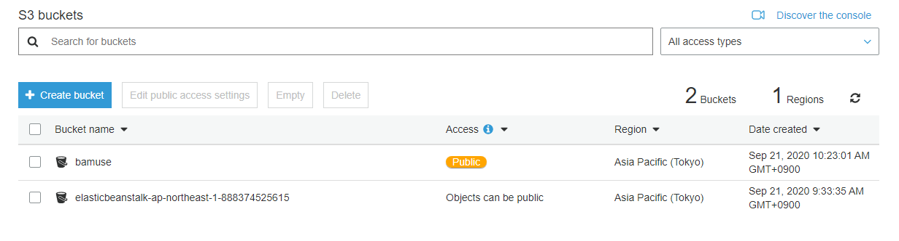
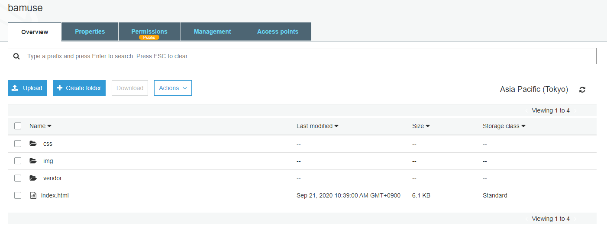
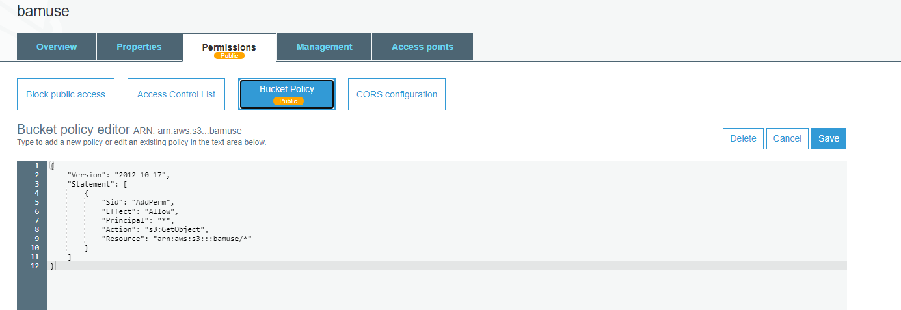
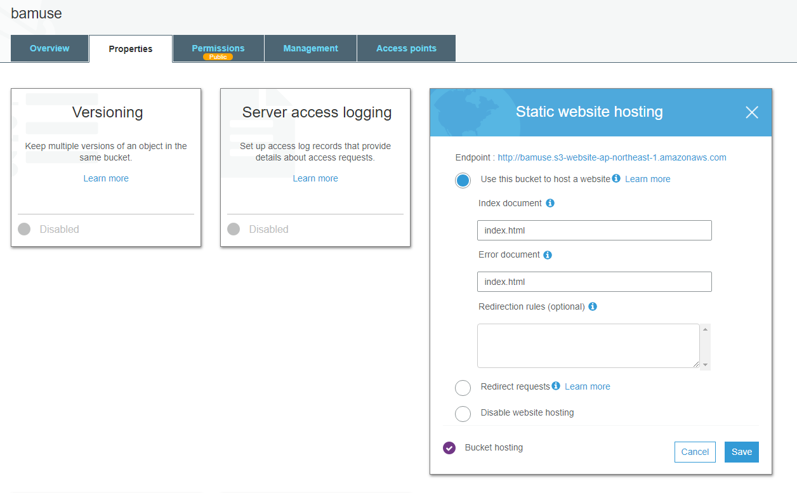
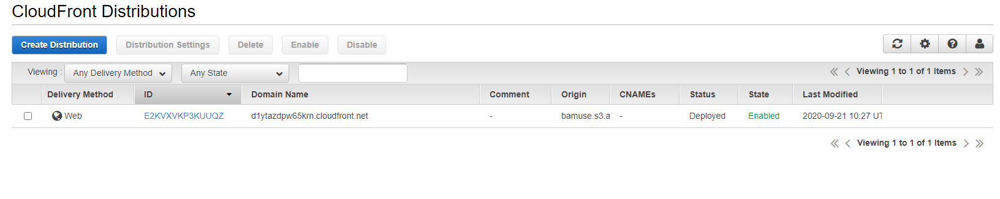
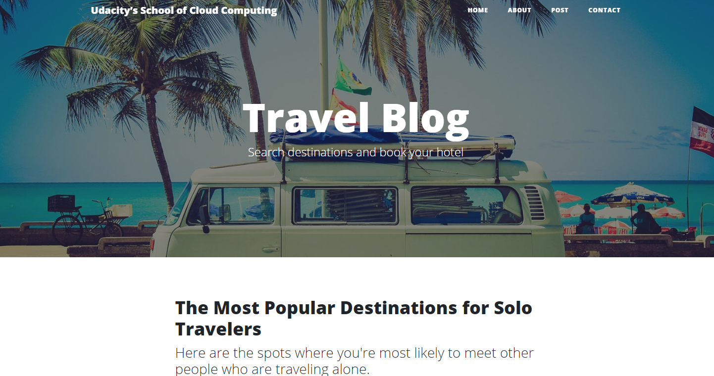

# Cloud DevOps Engineer
## project 1 Static Website on AWS

In this project
deploy a static website to AWS using S3, CloudFront, and IAM.

### 1. Create S3 Bucket

**S3**  
Amazon Simple Storage Service (or S3) is an object storage system in the cloud.  
**Storage Classes**  
S3 offers several storage classes, which are different data access levels for your data at certain price points.
- S3 Standard
- S3 Glacier
- S3 Glacier Deep Archive
- S3 Intelligent-Tiering
- S3 Standard Infrequent Access
- S3 One Zone-Infrequent Access

### 2. Upload files to S3 Bucket

### 3. Secure Bucket via IAM 

### 4. Configure S3 Bucket

### 5. Distribute Website via CloudFront

**Cloud Front**  
CloudFront is used as a global content delivery network (CDN). Cloud Front speeds up the delivery of your content through Amazon's worldwide network of mini-data centers called Edge Locations.
CloudFront works with other AWS services, as shown below, as an origin source for your application:

- Amazon S3
- Elastic Load Balancing
- Amazon EC2
- Lambda@Edge
- AWS Shield

### 6. Access Website in Web Browser

http://bamuse.s3-ap-northeast-1.amazonaws.com/index.html

